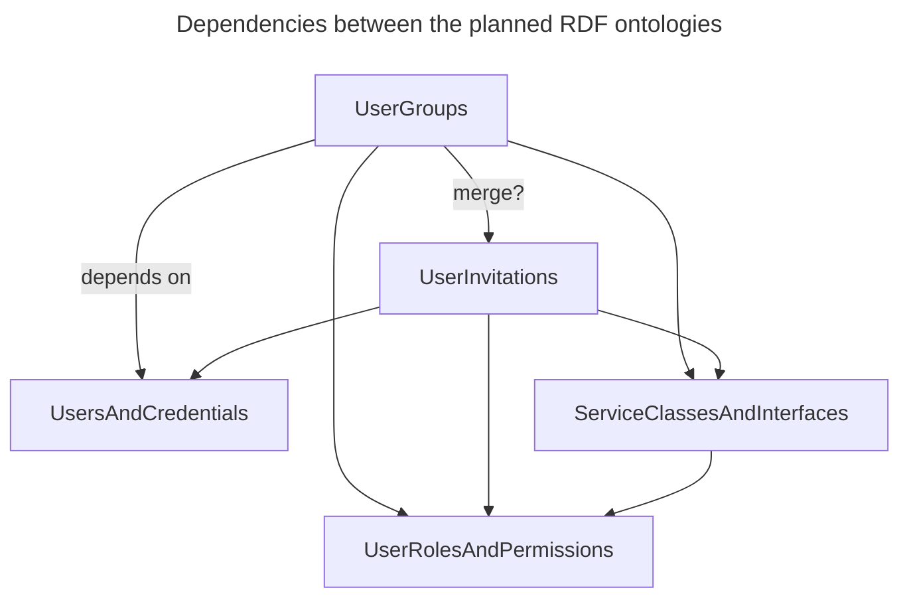
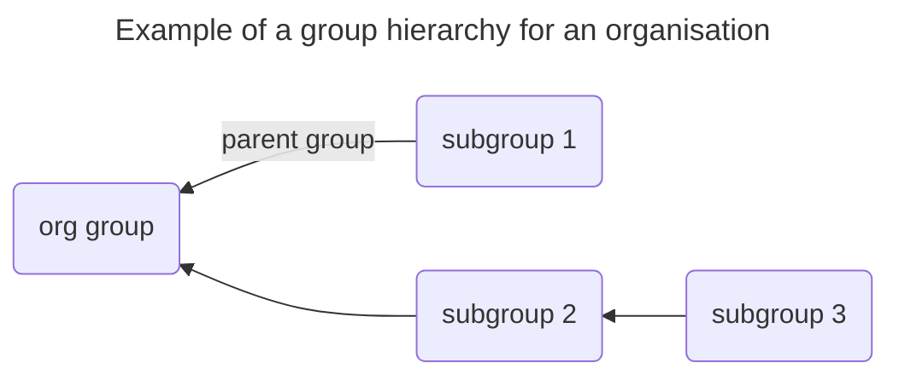
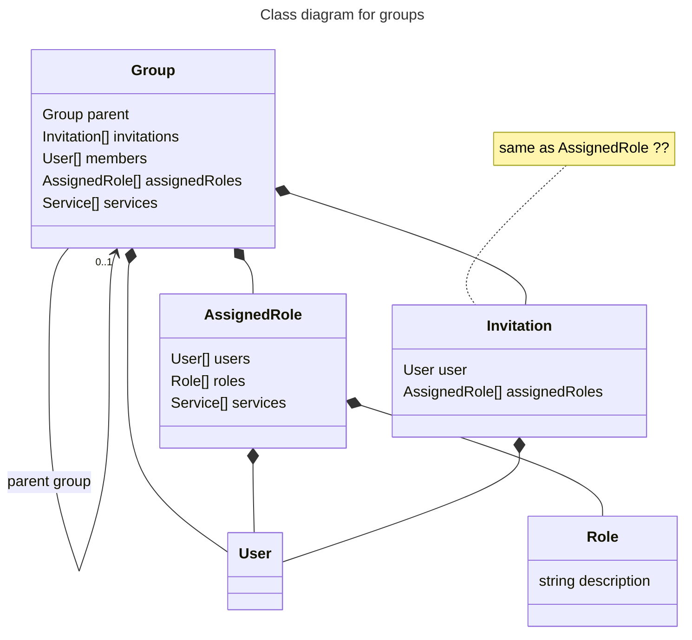

# Qworum ontology (work in progress)

A set of RDF ontologies for use within the [Qworum platform](https://qworum.net) and the larger RDF ecosystem.

## Overview

Data based on these ontologies are used as follows:

- an aide for Qworum developers
- a resource used internally by the Qworum platform (AI/RPA, run-time verification, user group management, marketplace listings)

These ontologies fall under two categories:

- User-related
- Service-related.

Rules for subgroups:

- users are a subset of parent group's users
- allowed services are a subset of parent group's allowed services

`UserInvitations`' dependencies are a subset of `UserGroups`' dependencies.

Define different namespaces for the RDF ontologies (= classes and properties) and the individuals (= well-known RDF class instances) ?

When should ontologies be merged or modularised ?

## Classes and interfaces

Description of Qworum classes and the interfaces they implement:

- A `qrmi:Interface` instance can extend zero, one, or more interface instances.
- A `qrmc:Class` instance implements exactly one interface.
- A `qrmi:Interface` instance can define properties and methods. A method is a `qrmi:Method` instance. Properties and method parameters can be JSON, RDF or a Qworum class. For properties and method parameters that are Qworum classes, the actual interface implementations can be indicated.
- For properties and method parameters that are `qrmc:Class` instances, a `qrmc:Class` instance can indicate which actual interface implementations they are using.

## Various terms

- `qrmv:end` — end-of-document indicator, used for ensuring the completeness of RDF documents that are being read, particularly in streaming scenarios.
- `qrmv:anyIRI` — an IRI that should not be dereferenced, either because it points to non-RDF content, or because it points to an RDF node that is not relevant for the current RDF dataset.
- `qrmv:comment` — a comment written in Markdown.

## License

This content is released under the terms of the [CC0 1.0 Universal](https://creativecommons.org/publicdomain/zero/1.0/deed.en) license.

∎
